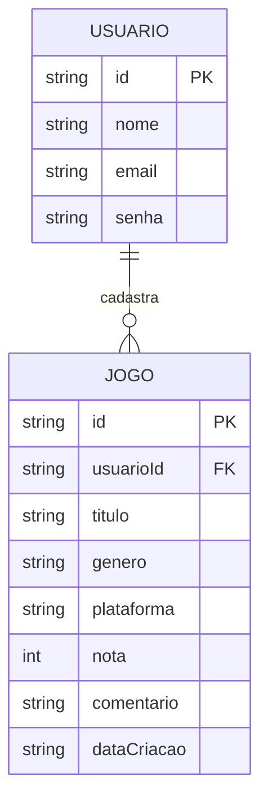

# 🛠️ Especificação Técnica (Tech Spec) - Gamory

Este documento descreve a arquitetura técnica, modelo de dados e contratos de API para a aplicação **Gamory**, uma plataforma web para avaliação e organização de jogos digitais.

---

# 1. 🧩 Arquitetura Geral

A aplicação será construída como uma **Single Page Application simples (SPA híbrida)** com múltiplas páginas HTML e uso de JavaScript para manipulação dinâmica dos dados.

### Tecnologias:

* HTML5
* CSS3 + Framework (Bootstrap ou similar)
* JavaScript (Vanilla)
* JSON Server (API fake)
* Web Storage (LocalStorage)

---

# 2. 🗂️ Estrutura de Páginas

A aplicação deve conter pelo menos **3 páginas HTML distintas**:

1. **login.html**

   * Login de usuário
   * Redirecionamento após autenticação

2. **cadastro.html**

   * Criação de conta
   * Validação de formulário

3. **index.html (Dashboard)**

   * Listagem de jogos
   * Visualização e interação

Todas as páginas devem ser **responsivas** utilizando o framework CSS escolhido.

---

# 3. 🧠 Modelo de Dados (Diagrama ER)



---

# 4. 📚 Dicionário de Dados

## 🔹 Usuários

Responsável pela autenticação e identificação.

* **id**: Identificador único gerado pelo JSON Server
* **nome**: Nome do usuário
* **email**: Usado para login
* **senha**: Armazenada em texto simples (MVP)

---

## 🔹 Jogos

Responsável pelo registro das experiências do usuário.

* **id**: Identificador único
* **usuarioId**: Relacionamento com usuário
* **titulo**: Nome do jogo
* **genero**: Categoria (RPG, FPS, etc.)
* **plataforma**: Plataforma (PC, PS5, Xbox, etc.)
* **nota**: Valor de 1 a 5
* **comentario**: Texto opcional
* **dataCriacao**: Data em formato ISO

---

# 5. 🔌 Rotas da API (JSON Server)

## 🔹 Usuários

* `GET /usuarios` → Lista usuários
* `POST /usuarios` → Cria novo usuário

## 🔹 Jogos

* `GET /jogos` → Lista jogos
* `GET /jogos?usuarioId=1` → Jogos de um usuário
* `POST /jogos` → Cria jogo
* `PUT /jogos/:id` → Atualiza jogo
* `DELETE /jogos/:id` → Remove jogo

---

# 6. 💾 Estrutura do Banco (db.json)

```json
{
  "usuarios": [
    {
      "id": "1",
      "nome": "Rafael",
      "email": "rafael@email.com",
      "senha": "123456"
    }
  ],
  "jogos": [
    {
      "id": "1",
      "usuarioId": "1",
      "titulo": "The Witcher 3",
      "genero": "RPG",
      "plataforma": "PC",
      "nota": 5,
      "comentario": "Um dos melhores jogos que já joguei",
      "dataCriacao": "2026-03-24"
    }
  ]
}
```


# 7. ✅ Critérios de Conclusão

* 3 páginas HTML implementadas
* Responsividade funcional
* CRUD completo de jogos
* Integração com JSON Ser
